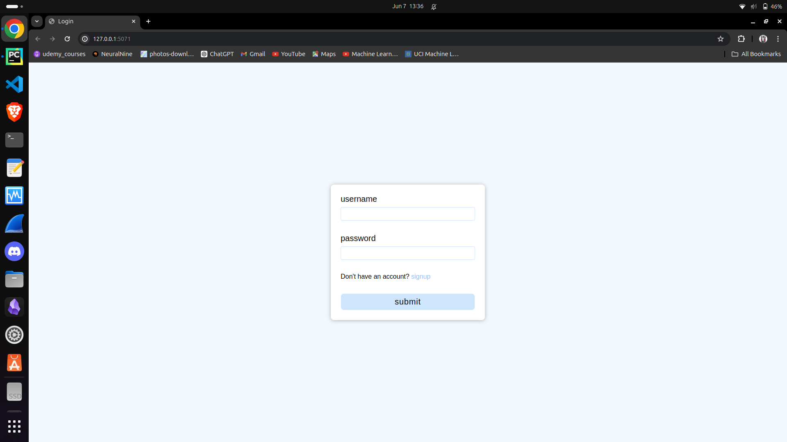
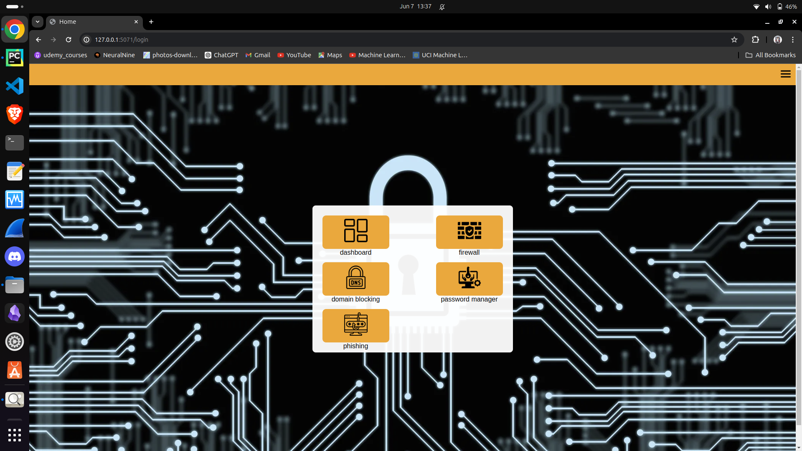
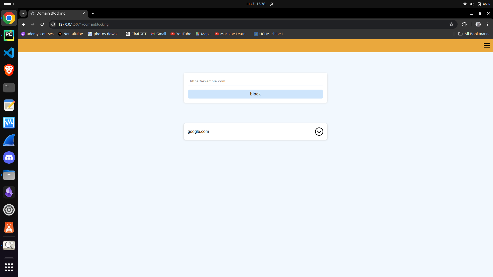
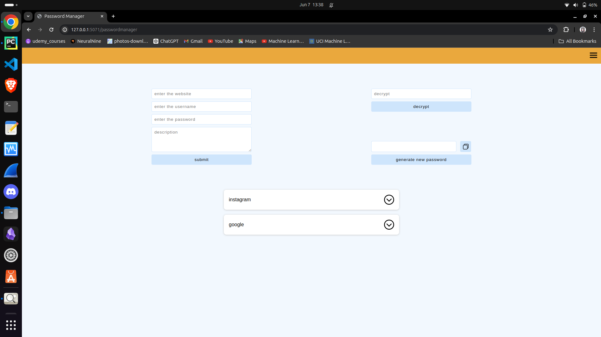
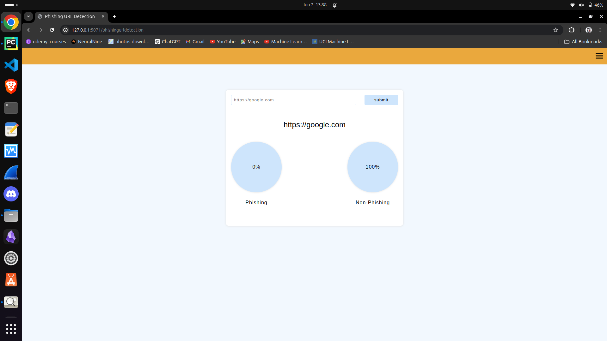
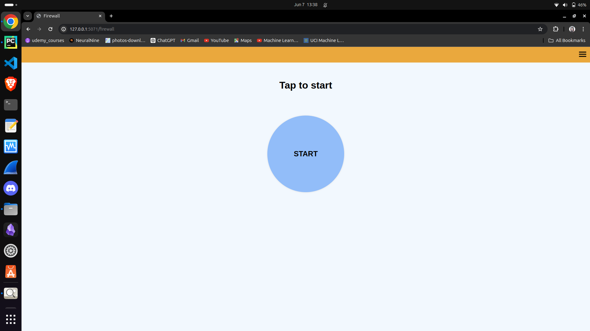

# Project-U1

<p>Project U1 is a comprehensive system security suite designed to block unauthorized access, predict phishing URLs, manage passwords securely, and block unwanted websites.</p>

## requirements
<ol>
    <li>python</li>
    <li>mysql service</li>
    <li>phishing dataset</li>
    <li>firewall rules</li>
    <li>python flask</li>
</ol>
Python is a versatile, high-level programming language known for its readability and extensive standard library. It supports multiple programming paradigms, including procedural, object-oriented, and functional programming. Flask is a lightweight web framework for Python that simplifies web application development with minimal code. Together, Python and Flask enable rapid development of robust and scalable web applications.

## pip requirements

#### 1. Flask 
```
pip install Flask
```
Flask is a lightweight web framework for Python, known for its simplicity and flexibility. It provides essential tools and features for building web applications, such as routing, templating, and a built-in development server. Flask's minimalistic design allows developers to add extensions as needed, making it highly customizable.

#### 2. mysql
```
pip install mysql-connector-python
```
MySQL is a widely-used open-source relational database management system known for its reliability and ease of use. It supports structured query language (SQL) for database management, allowing for efficient data retrieval and manipulation. MySQL is highly scalable and works well for both small applications and large-scale enterprise systems.

#### 3. scikit-learn
```
pip install scikit-learn
```
Scikit-learn is a robust machine learning library in Python that provides simple and efficient tools for data analysis and modeling. It includes a wide range of algorithms for classification, regression, clustering, and dimensionality reduction. Scikit-learn is designed to interoperate with NumPy and SciPy, making it a key component in the scientific Python ecosystem.

#### 4. numpy
```
pip install numpy
```
NumPy is a powerful library for numerical computing in Python, providing support for large, multi-dimensional arrays and matrices. It offers a wide range of mathematical functions to perform operations on these arrays efficiently. NumPy is essential for scientific computing, enabling fast and efficient manipulation of data.

#### 5. joblib
```
pip install joblib
```
Joblib is a Python library designed for efficient serialization and parallel computing. It enables fast and reliable saving and loading of large data and models, and provides tools for easy parallel processing to speed up computations. Joblib integrates seamlessly with libraries like NumPy and scikit-learn, enhancing performance in data science workflows.

## program overview



Upon launching, the application displays a login page, ensuring that no features can be accessed without logging in. If you don't have an account, please register to create one. Your account information is securely stored to protect your data. This security measure ensures that only authorized users can access the application.



### 1. dashboard

The dashboard is a hub for essential host machine details, including ISP and time zone data. It displays both private and public IP addresses alongside network specifics like country. Streamlining vital network insights, it offers a comprehensive snapshot of connectivity.

### 2. domain blocking

Domain blocking serves as a robust barrier against unwanted websites while also doubling as parental control, regulating access to approved sites.

### 3. password manager

A password manager securely stores and organizes login credentials for various accounts. It generates complex, unique passwords to enhance security. Password managers often feature autofill capabilities for seamless login experiences. Additionally, they may offer password auditing to identify and update weak or reused passwords.

### 4. phishing url detection

Phishing URL detection employs advanced algorithms to identify suspicious links. It analyzes URLs for signs of phishing attempts, such as irregular domain structures or known scam indicators. Real-time scanning ensures prompt detection and alerts users to potential risks. Integration with browsers or email clients enhances proactive protection against phishing threats.

### 5. firewall

A stateful firewall monitors the state of active connections, tracking their progress from initiation to termination. It inspects incoming and outgoing packets against established session states, allowing or denying traffic based on predefined rules. This enables better security by distinguishing legitimate packets from potential threats. Stateful inspection offers enhanced protection against advanced threats like DoS attacks and packet spoofing. Additionally, it can provide logging and reporting features for network administrators to analyze traffic patterns and potential security incidents.
